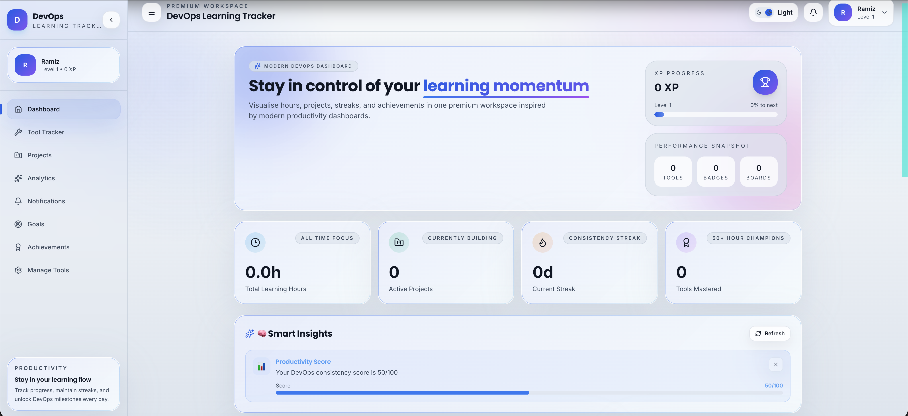
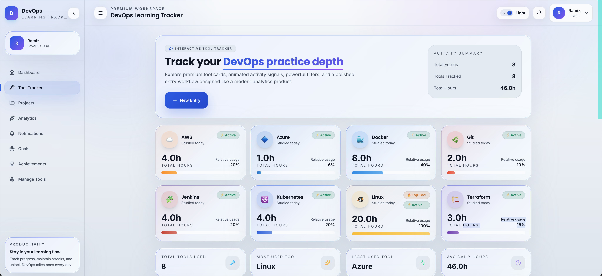
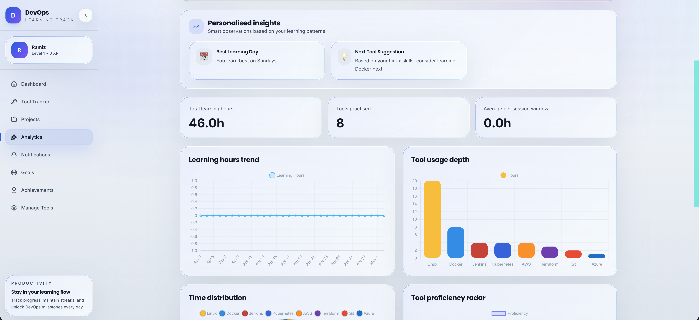
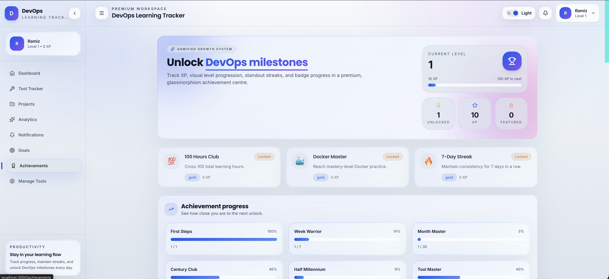
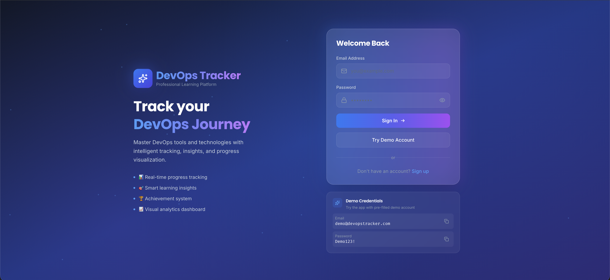

# 🚀 DevOps Daily Tracker

<div align="center">


**A comprehensive, production-ready web application for tracking your DevOps learning journey**

*Real-time analytics • Progress visualization • Achievement tracking • Kubernetes native*

[Quick Start](#-quick-start) • [Features](#-features) • [Screenshots](#-screenshots) • [Documentation](#-documentation)

</div>

---

## 📸 Screenshots

<div align="center">

### 🎯 Dashboard - Your Learning Hub

*Real-time statistics, weekly heatmap, and smart insights at a glance*

### 📊 Tool Tracker - Log Your Progress

*Track hours spent on Docker, Kubernetes, AWS, and more*

### 📈 Analytics - Visualize Your Growth

*Interactive charts showing your learning patterns and trends*

### 🏆 Achievements - Celebrate Milestones

*Unlock badges and track your accomplishments*

### 🔐 Secure Authentication

*JWT-based secure login with modern UI*

</div>

---

## 🎯 Overview

**DevOps Daily Tracker** is a modern, full-stack web application designed to help DevOps engineers, students, and professionals track their learning progress across various tools and technologies. Built with React, Node.js, and PostgreSQL, deployed on **Kubernetes** for production-grade reliability.

### ✨ Why Choose DevOps Daily Tracker?

<table>
<tr>
<td width="50%">

**📊 Comprehensive Tracking**
- Log daily hours for 8+ DevOps tools
- Multiple entries per day
- Add notes and context
- Real-time proficiency calculation

**🎯 Goal Management**
- Set learning goals with deadlines
- Track progress visually
- Get milestone notifications
- Celebrate achievements

</td>
<td width="50%">

**📈 Smart Analytics**
- Interactive charts and graphs
- Time distribution analysis
- Weekly/monthly comparisons
- Export as CSV/PDF

**☸️ Kubernetes Native**
- Production-ready deployment
- Auto-scaling capabilities
- Persistent data storage
- High availability

</td>
</tr>
</table>

---

## 🚀 Quick Start

### Prerequisites

- **Docker Desktop** with Kubernetes enabled
- **kubectl** installed
- **8GB RAM** minimum

### Deploy in One Command

```bash
# Clone repository
git clone <repository-url>
cd devops_daily_tracker

# Start application
./start.sh
```

**🎉 That's it!** Your application is now running.

**Access:** http://localhost:3000

**Demo Account:**
```
Email:    demo@devopstracker.com
Password: Demo123!
```

---

## 📝 Commands

<table>
<tr>
<td width="33%">

### 🚀 Start
```bash
./start.sh
```
Builds images, deploys to Kubernetes, creates demo user

</td>
<td width="33%">

### 🛑 Stop
```bash
./stop.sh
```
Stops all pods, **preserves data**

</td>
<td width="33%">

### 🧹 Cleanup
```bash
./cleanup.sh
```
**Removes everything** including database

</td>
</tr>
</table>

### Additional Commands

```bash
# View all resources
kubectl get all -n devops-tracker

# View logs
kubectl logs -n devops-tracker -l app=frontend -f
kubectl logs -n devops-tracker -l app=backend -f
kubectl logs -n devops-tracker postgres-0 -f

# Restart port-forward
kubectl port-forward -n devops-tracker svc/frontend-service 3000:3000
```

---

## ✨ Features

<table>
<tr>
<td width="50%">

### 🎯 Core Features

**Tool Tracking**
- 8+ predefined DevOps tools
- Custom time logging
- Notes and context
- Proficiency levels

**Dashboard**
- Real-time statistics
- Weekly activity heatmap
- Tool proficiency overview
- Recent activity feed
- Smart insights

**Analytics**
- Interactive charts
- Time distribution
- Tool usage trends
- Export capabilities

</td>
<td width="50%">

### 🏆 Advanced Features

**Project Management**
- Create DevOps projects
- Track progress
- Link tools to projects
- Status management

**Goals & Achievements**
- Set learning goals
- Track milestones
- Unlock badges
- Gamification

**Profile Management**
- Upload avatar
- Edit information
- Change password
- View statistics

</td>
</tr>
</table>

---

## 🛠 Tech Stack

<div align="center">

### Frontend


### Backend


### Infrastructure


</div>

---

## 🏗 Architecture

```
┌─────────────────────────────────────────────────────────────┐
│                    Kubernetes Cluster                        │
│                   (Docker Desktop K8s)                       │
│                                                              │
│  ┌──────────────┐  ┌──────────────┐  ┌──────────────┐      │
│  │   Frontend   │  │   Backend    │  │  PostgreSQL  │      │
│  │  (2 replicas)│  │  (2 replicas)│  │ (StatefulSet)│      │
│  │              │  │              │  │              │      │
│  │ Nginx+React  │  │ Node+Express │  │  PostgreSQL  │      │
│  │   Port 80    │  │  Port 5000   │  │  Port 5432   │      │
│  └──────┬───────┘  └──────┬───────┘  └──────┬───────┘      │
│         │                 │                  │              │
│  ┌──────▼───────┐  ┌──────▼───────┐  ┌──────▼───────┐      │
│  │   Service    │  │   Service    │  │   Service    │      │
│  │ LoadBalancer │  │  ClusterIP   │  │  ClusterIP   │      │
│  └──────┬───────┘  └──────────────┘  └──────┬───────┘      │
│         │                                    │              │
│         │                             ┌──────▼───────┐      │
│         │                             │     PVC      │      │
│         │                             │  (10GB Data) │      │
│         │                             └──────────────┘      │
└─────────┼──────────────────────────────────────────────────┘
          │
          ▼ Port-Forward
    http://localhost:3000
```

### Components

| Component | Description | Replicas | Storage |
|-----------|-------------|----------|---------|
| **Frontend** | Nginx + React SPA | 2 | - |
| **Backend** | Node.js + Express API | 2 | - |
| **PostgreSQL** | Database (StatefulSet) | 1 | 10GB PVC |

---

## 🔌 API Documentation

### Authentication

<details>
<summary><b>POST /api/auth/register</b> - Register new user</summary>

```json
{
  "username": "john_doe",
  "email": "john@example.com",
  "password": "SecurePass123!"
}
```
</details>

<details>
<summary><b>POST /api/auth/login</b> - Login user</summary>

```json
{
  "email": "john@example.com",
  "password": "SecurePass123!"
}
```
</details>

<details>
<summary><b>GET /api/auth/profile</b> - Get user profile</summary>

```bash
Authorization: Bearer <token>
```
</details>

### Tool Tracking

<details>
<summary><b>GET /api/tools</b> - Get all tools</summary>

```bash
Authorization: Bearer <token>
```
</details>

<details>
<summary><b>POST /api/tools/entries</b> - Create tool entry</summary>

```json
{
  "tool_id": 3,
  "date": "2026-05-02",
  "hours_spent": 2.5,
  "notes": "Learned Docker networking"
}
```
</details>

### Dashboard

<details>
<summary><b>GET /api/dashboard/stats</b> - Get dashboard statistics</summary>

```bash
Authorization: Bearer <token>
```
</details>

---

## 💻 Development

### Local Development Setup

```bash
# Install dependencies
cd frontend && npm install
cd ../backend && npm install

# Start backend (Terminal 1)
cd backend && npm run dev

# Start frontend (Terminal 2)
cd frontend && npm run dev

# Port-forward database (Terminal 3)
kubectl port-forward -n devops-tracker svc/postgres-service 5432:5432
```

### Environment Variables

**Backend (.env)**
```env
PORT=5000
NODE_ENV=development
JWT_SECRET=your-secret-key
DB_HOST=localhost
DB_PORT=5432
DB_NAME=devops_tracker
DB_USER=devops_user
DB_PASSWORD=devops_pass
```

**Frontend (.env)**
```env
VITE_API_URL=http://localhost:5000
```

---

## 🔧 Troubleshooting

<details>
<summary><b>Port Already in Use</b></summary>

```bash
# Find process using port 3000
lsof -i :3000

# Kill the process
kill -9 <PID>
```
</details>

<details>
<summary><b>Pods Not Starting</b></summary>

```bash
# Check pod status
kubectl get pods -n devops-tracker

# Check pod logs
kubectl logs <pod-name> -n devops-tracker

# Describe pod for events
kubectl describe pod <pod-name> -n devops-tracker
```
</details>

<details>
<summary><b>Database Connection Failed</b></summary>

```bash
# Check PostgreSQL logs
kubectl logs postgres-0 -n devops-tracker

# Restart PostgreSQL pod
kubectl delete pod postgres-0 -n devops-tracker
```
</details>

<details>
<summary><b>Reset Everything</b></summary>

```bash
./cleanup.sh
./start.sh
```
</details>

---

## 📊 Resource Requirements

| Resource | Minimum | Recommended |
|----------|---------|-------------|
| **CPU** | 2 cores | 4 cores |
| **Memory** | 4GB | 8GB |
| **Storage** | 15GB | 20GB |
| **Kubernetes** | v1.20+ | v1.28+ |

---

## 🔒 Security Features

- ✅ **JWT Authentication** - 7-day token expiration
- ✅ **Password Hashing** - bcrypt with salt rounds
- ✅ **SQL Injection Protection** - Parameterized queries
- ✅ **XSS Protection** - React's built-in escaping
- ✅ **CORS** - Configured for specific origins
- ✅ **HTTPS Ready** - SSL/TLS support

---

## 📚 Documentation

- **Quick Start**: See above
- **API Reference**: See API Documentation section
- **Kubernetes Manifests**: `k8s/` directory
- **Source Code**: `backend/` and `frontend/` directories

---

## 🤝 Contributing

Contributions are welcome! Please feel free to submit a Pull Request.

1. Fork the repository
2. Create your feature branch (`git checkout -b feature/AmazingFeature`)
3. Commit your changes (`git commit -m 'Add some AmazingFeature'`)
4. Push to the branch (`git push origin feature/AmazingFeature`)
5. Open a Pull Request

---

## 📝 License

This project is licensed under the MIT License - free to use for learning and portfolio purposes.

---

## 🎉 Acknowledgments

Built with ❤️ using modern web technologies and Kubernetes best practices.

<div align="center">

**⭐ Star this repo if you find it helpful!**

**Happy Learning! 🚀**

---

Made with 💙 by DevOps Enthusiasts

</div>